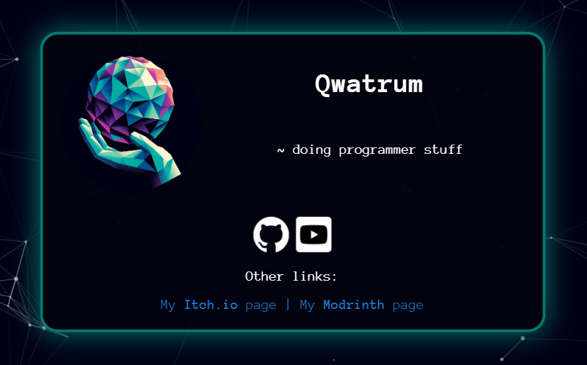

# Portfolio
---
###### My portfolio website

---

## [View it here](https://qwatrum.github.io)

## Features:
* Landing page with particles background
* Box with social links

* About Me section
* Project showcase
* 404 page

## How to use:
* [View it here](https://qwatrum.github.io)
* Or clone the repo and host it on your own

## Credits:
* Code: Qwatrum
* Design: Qwatrum
* Particles background: Vincent Garreau
* Typing SVG: DenverCoder1
* Font: Anonymous Pro (Google Fonts)

made with <3 by Qwatrum